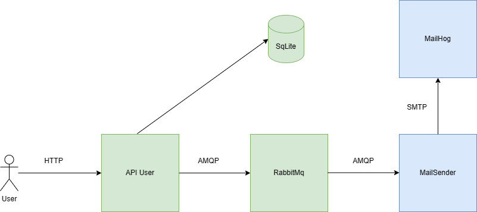
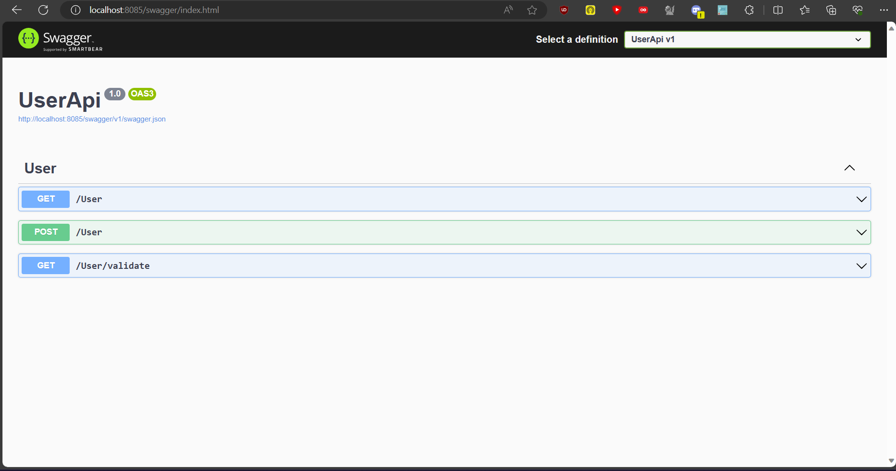
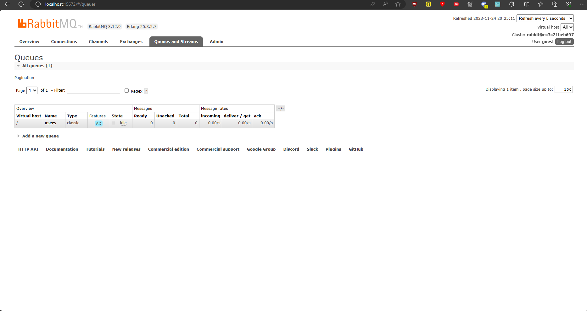

# API REST users

## Description du Projet

Cette API fournie des opérations GET et ADD pour ajouter un nouvel utilisateur.
Les données sont sauvegardées dans un fichier DB SqLite en local sur la machine.

L'API va ensuite publier un message dans une queue RabbitMQ qui va ensuite être consommé par un second web service. Celui-ci va ensuite envoyer un mail à MailHog comme le montre le schéma d'architecture suivant : 



## Screenshot






## Installation

Créer un network Docker : 

```bash
docker network create external-network
```

Lancer Docker Compose à la racine du projet :

```bash
docker-compose up
```

Le swagger se trouve à l'adresse http://localhost:8085/swagger/index.html
RabbitMq se trouve à l'adresse http://localhost:15672 et vous pouvez vous identifier avec l'id/password guest/guest.

## Ajout de users

Pour ajouter un nouvel utilisateur, utilisez simplement la requête POST du Swagger et respectez la formalisation suivante :
```json
{
    "firstName": "John",
    "lastName": "Cena",
    "email": "john.cena@outlook.com"
}
```

## Auteur

Théo RAMOUSSE
